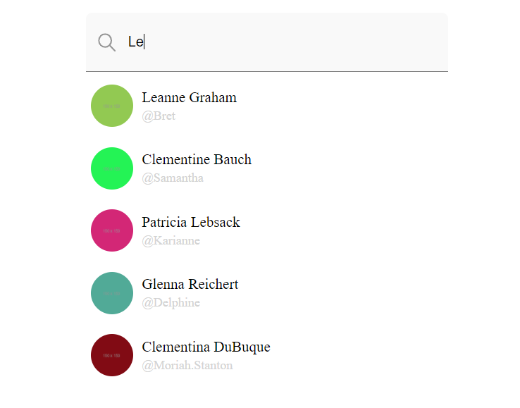

# Live Search

A Live Search app using React and testing with Jest.
Searching was implemented with additional packages.

> This is an assigment for creating LiveSearch app

Additional description about the project and its features.

## Spend Hours

I spent about 5 hours of dedicated time to accomplish it

## Built With

- React,
- axios,
- CSS,
- TypeScript,
- npm,
- webpack

## Getting Started

To get a local copy up and running follow these simple example steps.

### Prerequisites

- A compatible browser with HTML, CSS and TypeScript.

### Install

- Just clone the project
- `npm install` to install necessary dependencies;
- `npm start` to start dev server;

### Test

- `npm run test` to start testing;

### Usage

- You can use it as Live searcher

## Author

👤 **Niiazaly Dzhumaliev**

- Github: [@NiiazalyDzhumaliev](https://github.com/NiiazalyDzhumaliev)
- Twitter: [@Niiazaly1](https://twitter.com/Niiazaly1)
- Linkedin: [@niiazaly-dzhumaliev](https://www.linkedin.com/in/niiazaly-dzhumaliev-117707132/)

## 🤝 Contributing

Contributions, issues and feature requests are welcome!

Feel free to check the [issues page](https://github.com/NiiazalyDzhumaliev/live-search/issues).

## Show your support

Give a ⭐️ if you like this project!

## Acknowledgments

- Scrile

## 📝 License

This project is free to use as learning purposes. For any external content (e.g. logo, images, ...), please contact the proper author and check their license of use.
